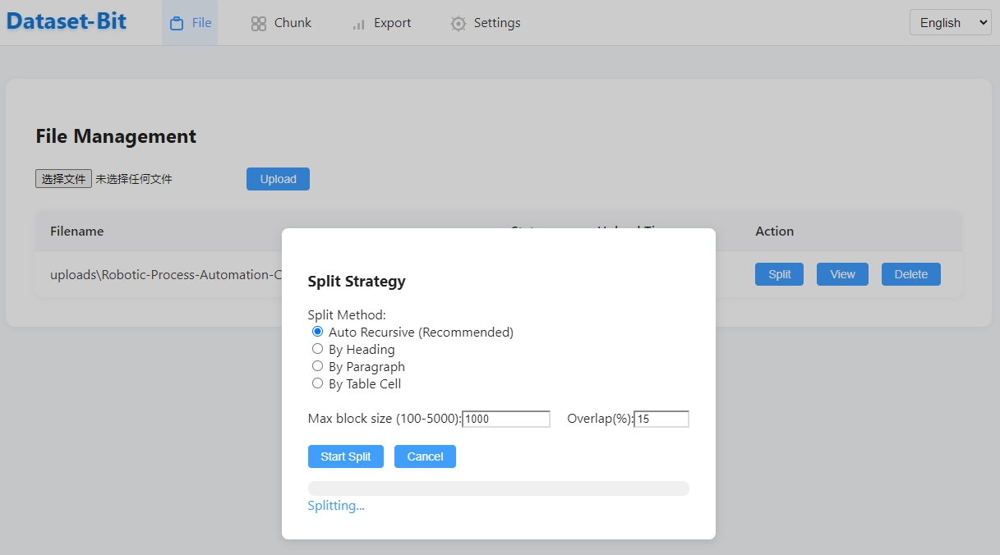
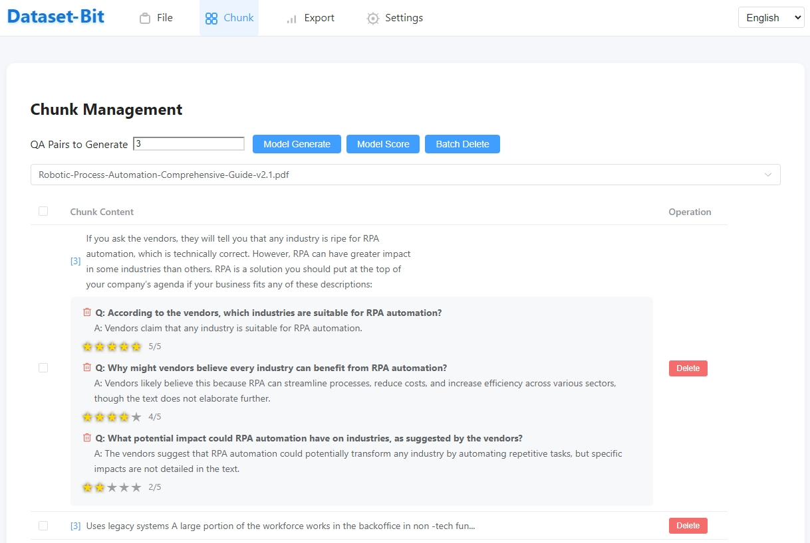
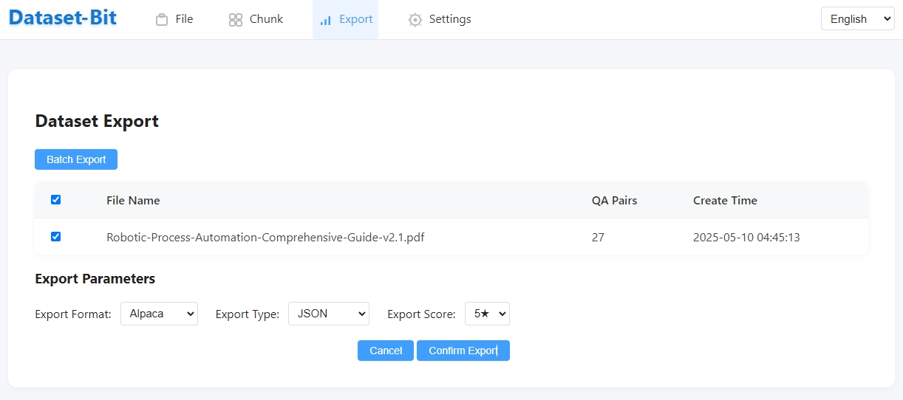

# Dataset-Bit 🚀

[](https://www.python.org/downloads/)
[](https://fastapi.tiangolo.com/)
[](https://vuejs.org/)
[](LICENSE)

[English](README.md) | [中文](README_CN.md)

---

## 📖 Project Overview

Dataset-Bit is an open-source tool for building fine-tuning datasets for large language models (LLMs). It supports smart chunking of various document formats, automatic/manual generation of high-quality Q&A pairs, flexible scoring and export, making it suitable for developers, data annotation teams, and AI researchers.

### ✨ Key Features
- **Smart Document Chunking**: Upload documents in multiple formats, support various chunking strategies and custom parameters.
- **AI Q&A Generation**: Batch-select chunks and automatically generate high-quality Q&A pairs with progress visualization.
- **AI Q&A Scoring**: Support manual 5-star scoring and batch AI auto-scoring, with real-time result saving.
- **Flexible Data Export**: Export in Alpaca, ShareGPT, and other formats, filter high-quality Q&A pairs by star rating.
- **Flexible System Configuration**: Support flexible parameter configuration and custom options to meet personal needs.

---

## 🛠️ Tech Stack
- **Backend**: FastAPI + Python 3.8+ + SQLite
- **Frontend**: Vue3 + Element Plus + Vanilla JS
- **AI Model**: Supports OpenAI/custom API, both scoring and Q&A generation are configurable

---

## 🚀 Installation & Startup
1. Clone the repository and enter the directory
```bash
git clone https://github.com/yorko-ai/dataset-bit.git
cd dataset-bit
```
2. Install dependencies
```bash
python -m venv venv
# Windows
venv\Scripts\activate
# Linux/Mac
source venv/bin/activate
pip install -r requirements.txt
```
3. Initialize the database
```bash
sqlite3 dataset_bit.db < init_db.sql
```
4. Configure .env and fill in your API key
5. Start the backend
```bash
python main.py
```
6. Visit http://localhost:8000

---

## 📁 Project Structure
```
dataset-bit/
├── app/                # Backend main program
│   ├── main.py         # FastAPI entry
│   ├── ...
├── frontend/           # Frontend pages and static resources
│   └── templates/
├── uploads/            # Upload directory
├── exports/            # Export directory
├── init_db.sql         # Database schema
├── requirements.txt    # Dependencies
└── README.md
```

---

## 👨‍💻 Development Guide
- Backend: PEP8, type hints, logging, async I/O, unit tests
- Frontend: Vue3 Composition API, componentization, TypeScript, responsive design, ESLint
- Contribution: Fork, branch, PR, with tests

---

## 📝 Changelog
### v1.0.4
- Initial release: supports document chunking, AI Q&A generation, scoring, export, batch operations, and more

---

## 🖼️ UI Preview
- Dataset management, chunk management, Q&A scoring, export, and other pages all support batch operations and progress bars, with a clean and beautiful interface.
### Smart Chunking
- 
### Dataset Management
- 
### Dataset Export
- 
### Alpaca Format Example
```
[
  {
    "instruction": "What is the main purpose of the disclaimer mentioned in the text?",
    "input": "",
    "output": "The main purpose of the disclaimer is to inform readers that the document may contain references to products or services not available in all regions."
  },
  {
    "instruction": "Can you provide an example of a situation where this disclaimer might be important?",
    "input": "",
    "output": "This disclaimer might be important if a reader from a specific region tries to access or purchase a product or service mentioned in the document but finds it unavailable in their area."
  },
  {
    "instruction": "Is the document guaranteed to offer global availability for all its referenced products and services?",
    "input": "",
    "output": "No, the document explicitly states that not all products or services mentioned may be available globally."
  },
  {
    "instruction": "How might this disclaimer affect a business's marketing strategy?",
    "input": "",
    "output": "The disclaimer could lead a business to adjust its marketing strategy by clearly indicating regional availability for certain products or services to manage customer expectations."
  },
  {
    "instruction": "What should a user do if they encounter a product or service in this document that is unavailable in their region?",
    "input": "",
    "output": "If a user encounters a product or service unavailable in their region, they should consider exploring alternative options or contacting the provider for more information on potential future availability."
  },
  {
    "instruction": "What is the book dedicated to?",
    "input": "",
    "output": "The book is dedicated to all children with Progeria."
  }
]
```
---

## 📚 Main Feature Description

### 1. File Management
- Support uploading, deleting, and status management for multiple formats

### 2. Chunk Management
- Smart chunking (paragraph/heading/recursive/table)
- Expand chunk content to view full text
- Support batch selection and batch deletion

### 3. Q&A Generation and Management
- Batch generate Q&A pairs after selecting chunks, with progress bar
- Q&A pairs support manual editing and deletion

### 4. Scoring System
- Each Q&A pair can be manually rated 1-5 stars, with highlighted stars
- Support batch auto-scoring via external API, with real-time progress feedback
- Scoring results are saved in real time, supporting multiple languages

### 5. Data Export
- Support Alpaca, ShareGPT, and other formats, with JSON/CSV/Markdown types
- Filter by star rating when exporting (only export Q&A pairs with a score above the specified value)

### 6. System Settings
- Support scoring model API parameter configuration and connection testing
- Support interface language and theme switching

### 7. UI & Experience
- Unified styles for global buttons, dropdowns, rating controls, etc.
- All batch operations, progress bars, and pop-ups are beautifully centered
- No registration or login required, ready to use out of the box

---

## 🗄️ Database Structure (Brief)

- **files**: File information
- **text_segments**: Chunk content
- **qa_pairs**: Q&A pairs (with score field)
- **settings**: System and API parameters

See `init_db.sql` for details.

---

## 📑 API Endpoints (Partial)
- `/api/upload` Upload file
- `/api/files` Get file list
- `/api/files/{file_id}/chunks` Get chunks
- `/api/chunks/{segment_id}/qa` Get Q&A pairs under a chunk
- `/api/qa-pairs/{qa_id}/score` Get/set Q&A pair score
- `/api/qa-pairs/auto-score` Batch auto-scoring
- `/api/generate-qa` Batch generate Q&A pairs
- `/api/datasets_export` Data export (supports star rating filter)
- `/api/chunks_delete` Batch delete chunks

---

## Quick Start

### 1. Pull the image

```bash
docker pull yorko/dataset-bit:latest
```

### 2. Run the container

```bash
docker run -d -p 8000:8000 yorko/dataset-bit:latest
```

Then open [http://localhost:8000](http://localhost:8000) in your browser.

## Advanced Usage (Docker Compose)

Create a `docker-compose.yml` file:

```yaml
version: '3.8'

services:
  web:
    image: yorko/dataset-bit:latest
    ports:
      - "8000:8000"
    environment:
      - APP_HOST=0.0.0.0
      - APP_PORT=8000
    restart: unless-stopped
```

Start the service:

```bash
docker-compose up -d
```

## Notes

- The image includes an initialized `dataset_bit.db` database and all files in the `uploads` directory at build time.
- For persistent data, it is recommended to mount the `/app/uploads` and `/app/exports` directories.

---

## 📝 Contribution & Feedback
- Issues, PRs, and suggestions are welcome
- For detailed development specifications and secondary development advice, see code comments and API documentation

---

## 📄 License
MIT License. See LICENSE for details.

---

## 📞 Contact
- Author: Yorko Liu
- Email: liutiansi@gmail.com
- Github: [yorkoliu](https://github.com/yorko-ai/dataset-bit)

---

## 🙏 Acknowledgement
Thanks to all contributors and users of this project!
