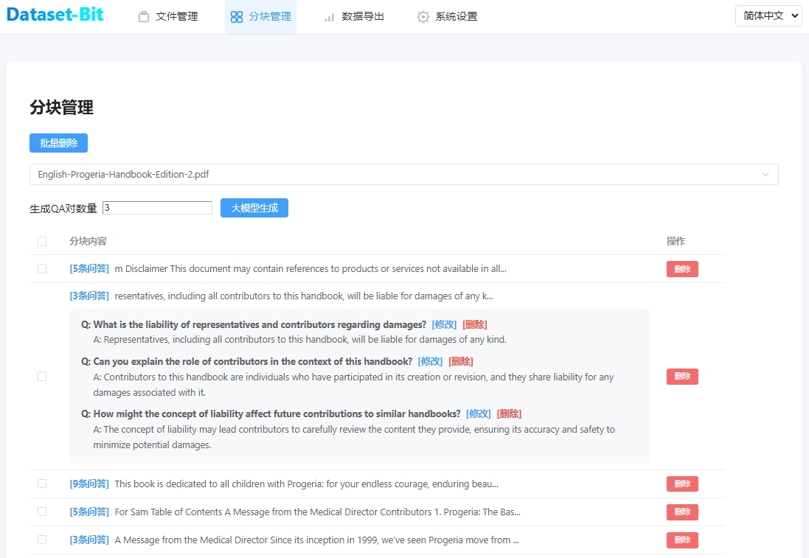
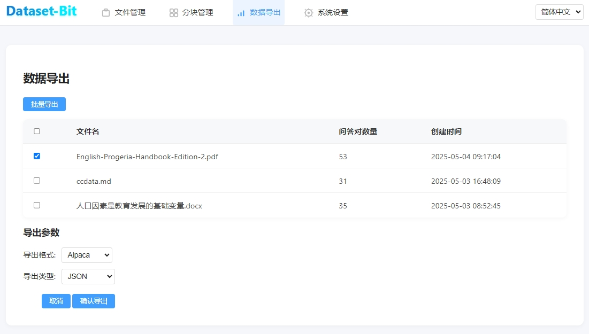
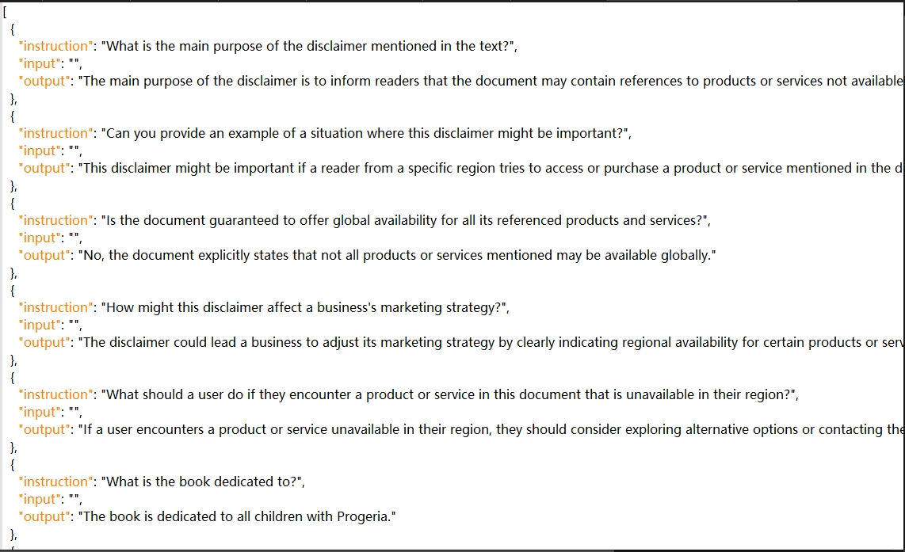

# Dataset-Bit 🚀

<div align="center">

[](https://www.python.org/downloads/)
[](https://fastapi.tiangolo.com/)
[](https://vuejs.org/)
[](LICENSE)
[](https://github.com/yorkoliu/dataset-bit/stargazers)

[English](README.md) | [中文](README_CN.md)

</div>

## 📖 Project Introduction

Dataset-Bit is a powerful open-source tool designed for generating and optimizing fine-tuning datasets for Large Language Models (LLMs). It intelligently extracts text from various documents, generates high-quality question-answer pairs, and exports them in standard training dataset formats. Whether you're a researcher, developer, or data scientist, Dataset-Bit helps you quickly build high-quality LLM training data.

### ✨ Core Features

- 📚 **Multi-format Support**: Supports TXT, MD, DOCX, PDF, and more
- 🔍 **Smart Segmentation**: Intelligent text segmentation based on paragraphs or headings
- 🤖 **AI Generation**: Automatically generates diverse, high-quality questions and answers
- 📊 **Quality Assessment**: Built-in QA pair quality evaluation system
- 📦 **Format Conversion**: Supports multiple dataset formats like Alpaca, ShareGPT
- 📈 **Data Statistics**: Complete file management and data analysis
- 🔄 **Batch Processing**: Supports batch file processing and parallel processing
- 🎯 **Custom Configuration**: Flexible parameter configuration and customization options

## 🛠️ Tech Stack

### Backend
- **Framework**: FastAPI
- **Language**: Python 3.8+
- **Database**: SQLite
- **AI Model**: OpenAI GPT-3.5
- **Document Processing**: PyPDF2, python-docx, markdown

### Frontend
- **Framework**: Vue.js 3
- **Build Tool**: Vite
- **UI Components**: Element Plus
- **State Management**: Pinia
- **HTTP Client**: Axios

## 🚀 Quick Start

### System Requirements
- Python 3.8 or higher
- Node.js 16 or higher
- Minimum 4GB RAM
- Stable internet connection

### Database Initialization
This project uses SQLite. Before the first run, please initialize the database structure with:

```bash
sqlite3 dataset_bit.db < init_db.sql
```
If you don't have the `sqlite3` CLI tool, you can also initialize via Python script, see `app/models/database.py`.

### Installation Steps

1. **Clone Repository**
```bash
git clone https://github.com/yorkoliu/dataset-bit.git
cd dataset-bit
```

2. **Set Up Python Environment**
```bash
# Create virtual environment
python -m venv venv

# Activate virtual environment
# Windows
venv\Scripts\activate
# Linux/Mac
source venv/bin/activate

# Install dependencies
pip install -r requirements.txt
```

3. **Configure Environment Variables**
```bash
# Copy environment variable template
cp .env.example .env

# Edit .env file, set necessary configurations
# Especially OPENAI_API_KEY and other required API keys
```

4. **Start Services**
```bash
# Start backend service
python -m app.main
```

5. **Access Application**
- Frontend Interface: http://localhost:8000
- API Documentation: http://localhost:8000/docs
- Health Check: http://localhost:8000/health

## 📚 Detailed Documentation

### API Endpoints

#### File Management
| Endpoint | Method | Description |
|----------|--------|-------------|
| `/api/upload` | POST | Upload file |
| `/api/files` | GET | Get file list |
| `/api/files/{file_id}` | GET | Get file details |
| `/api/files/{file_id}` | DELETE | Delete file |

#### Text Processing
| Endpoint | Method | Description |
|----------|--------|-------------|
| `/api/process/{file_id}` | POST | Process file and generate QA pairs |
| `/api/segments/{segment_id}/qa` | GET | Get QA pairs |

#### Data Export
| Endpoint | Method | Description |
|----------|--------|-------------|
| `/api/export/{file_id}` | POST | Export dataset |
| `/api/stats` | GET | Get dataset statistics |

### Configuration Parameters

#### Text Processing Parameters
```json
{
  "method": "paragraph",  // Segmentation method: paragraph/heading
  "min_length": 100,     // Minimum paragraph length
  "max_length": 1000,    // Maximum paragraph length
  "question_types": ["what", "how", "why"],  // Question types
  "difficulty": "medium",  // Question difficulty
  "questions_per_segment": 3,  // Questions per segment
  "answer_style": "detailed"  // Answer style
}
```

## 📁 Project Structure

```
dataset-bit/
├── app/
│   ├── main.py              # Main application entry
│   ├── routers/             # API route definitions
│   │   └── api.py
│   ├── services/            # Business service layer
│   │   ├── file_service.py  # File processing service
│   │   ├── llm_service.py   # LLM service
│   │   └── db_service.py    # Database service
│   ├── models/              # Data models
│   │   └── database.py
│   └── utils/               # Utility functions
│       ├── batch_processor.py
│       ├── file_handler.py
│       └── quality_evaluator.py
├── frontend/                # Frontend code
│   ├── src/
│   │   ├── components/      # Vue components
│   │   ├── views/          # Page views
│   │   ├── store/          # State management
│   │   └── api/            # API calls
│   └── public/             # Static resources
├── tests/                   # Test cases
├── uploads/                 # Upload directory
├── exports/                 # Export directory
├── .env.example            # Environment variables example
├── requirements.txt        # Python dependencies
└── README.md              # Project documentation
```

## 👥 Development Guidelines

### Backend Development Standards
1. Follow PEP 8 coding standards
2. Use type annotations
3. Write unit tests (coverage > 80%)
4. Use logging for key operations
5. Use async programming for I/O operations

### Frontend Development Standards
1. Use Vue 3 Composition API
2. Follow component-based development principles
3. Use TypeScript for type checking
4. Implement responsive design
5. Follow ESLint standards

## 🤝 Contributing

We welcome contributions in any form, including but not limited to:

1. Submitting issues and suggestions
2. Improving documentation
3. Submitting code improvements
4. Sharing usage experiences

### Contribution Process

1. Fork the project
2. Create feature branch (`git checkout -b feature/AmazingFeature`)
3. Commit changes (`git commit -m 'Add some AmazingFeature'`)
4. Push to branch (`git push origin feature/AmazingFeature`)
5. Create Pull Request

### Code Standards

- Follow [Conventional Commits](https://www.conventionalcommits.org/) for commit messages
- Include tests for code changes
- Ensure all tests pass
- Update relevant documentation

## 📝 Changelog

### v1.0.0 (2025-05-03)
- 🎉 Initial release
- ✨ Implement basic features
- 📚 Support multiple document formats
- 🤖 Integrate OpenAI GPT-3.5
- 🎨 Implement basic UI interface

## 📄 License

This project is licensed under the MIT License - see the [LICENSE](LICENSE) file for details

## 📞 Contact

- Author: York Liu
- Email: liutiansi@gmail.com
- WeChat: yorkoliu
- GitHub: [yorkoliu](https://github.com/yorkoliu)
- Project Home: [Dataset-Bit](https://github.com/yorkoliu/dataset-bit)

## 🙏 Acknowledgments

Thanks to all developers who have contributed to this project!

---

<div align="center">
  <sub>Built with ❤️ by <a href="https://github.com/yorkoliu">York Liu</a></sub>
</div>

## System Screenshots

### 1. Dataset Management Interface


> Used for uploading, managing, and chunking various data files. Supports multi-language switching and batch operations.

### 2. Dataset Export Interface


> Supports exporting QA pairs in multiple formats (such as Alpaca, ChatGLM, etc.), flexible parameter selection, and unified UI style.

### 3. Alpaca Dataset Example


> Shows QA pairs in Alpaca format, with pagination, batch operations, and multi-language switching.

---

## Additional Notes
- All interfaces support dark/light theme switching, with highly unified UI style.
- Supports one-click switching between Chinese and English, all prompts, buttons, and table headers are fully internationalized.
- See below for detailed feature descriptions and usage instructions. 