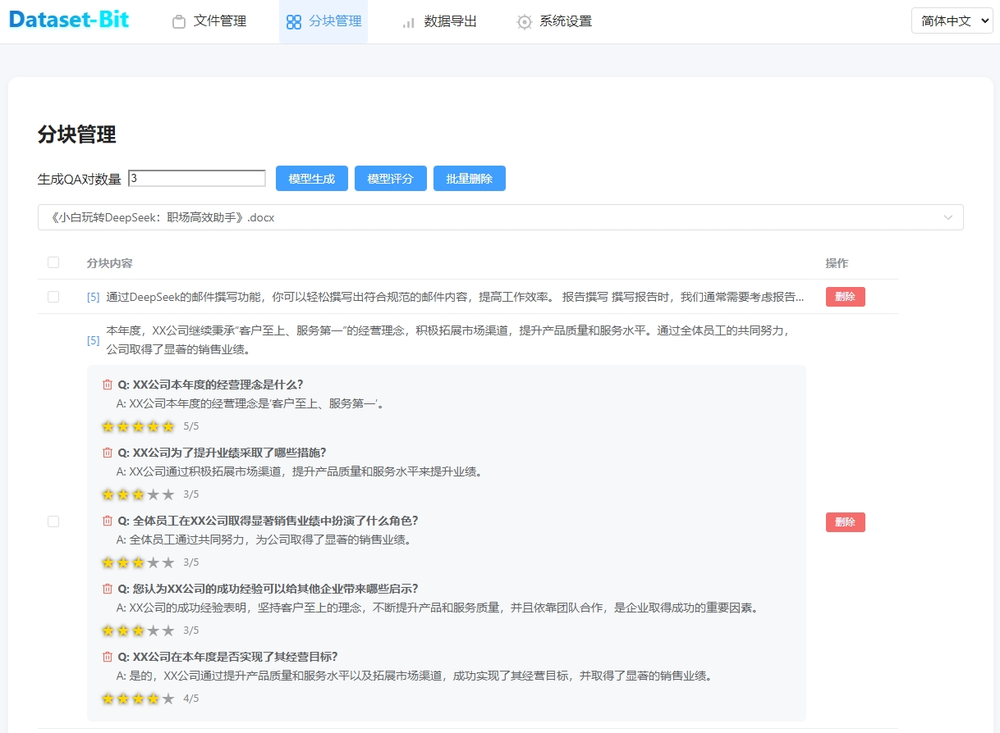
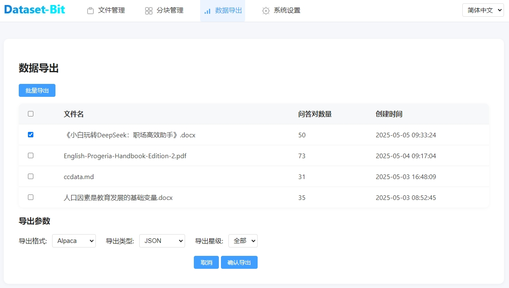

# Dataset-Bit 🚀

[](https://www.python.org/downloads/)
[](https://fastapi.tiangolo.com/)
[](https://vuejs.org/)
[](LICENSE)

[English](README_EN.md) | [中文](README.md)

---

## 📖 项目简介

Dataset-Bit 是一款面向大语言模型（LLM）微调数据集构建的开源工具，支持从多种文档智能分块、自动/人工生成高质量问答对、灵活评分与筛选导出，适合开发者、数据标注团队和AI研究者。

### ✨ 主要功能
- **文档智能分块**：多格式文档上传，支持多种智能分块方式及参数自定义
- **AI问答生成**：批量选中分块，自动生成高质量问答对，进度可视
- **AI问答评分**：支持人工5星评分与批量AI自动评分，结果实时保存
- **灵活数据导出**：支持Alpaca、ShareGPT等格式导出，按星级筛选高质量问答对
- **灵活系统配置**：支持灵活的参数配置和自定义选项来满足个人性需求

---

## 🛠️ 技术栈
- **后端**：FastAPI + Python 3.8+ + SQLite
- **前端**：Vue3 + Element Plus + 原生JS
- **AI模型**：支持OpenAI/自定义API，评分与问答均可配置

---

## 🚀 安装与启动
1. 克隆仓库并进入目录
```bash
   git clone https://gitee.com/yorkoliu/dataset-bit.git
cd dataset-bit
```
2. 安装依赖
```bash
python -m venv venv
# Windows
venv\Scripts\activate
# Linux/Mac
source venv/bin/activate
pip install -r requirements.txt
```
3. 初始化数据库
```bash
   sqlite3 dataset_bit.db < init_db.sql
   ```
4. 配置.env，填写API密钥
5. 启动后端
```bash
   python main.py
   ```
6. 访问 http://localhost:8000

---

## 📁 项目结构
```
dataset-bit/
├── app/                # 后端主程序
│   ├── main.py         # FastAPI入口
│   ├── ...
├── frontend/           # 前端页面与静态资源
│   └── templates/
├── uploads/            # 上传文件目录
├── exports/            # 导出文件目录
├── init_db.sql         # 数据库结构
├── requirements.txt    # 依赖
└── README.md
```

---

## 👨‍💻 开发指南
- 后端：PEP8规范，类型注解，日志记录，异步I/O，单元测试
- 前端：Vue3组合式API，组件化，TypeScript，响应式设计，ESLint
- 贡献建议：Fork、分支开发、PR、附带测试

---

## 📝 更新日志
### v1.0.1
- 首次发布，支持文档分块、AI问答生成、评分、导出、批量操作等核心功能


---

## 🖼️ 系统界面预览
- 数据集管理、分块管理、问答评分、导出等页面均支持批量操作与进度条，界面简洁美观。
### 数据智能分块
- 
### 数据集管理
- 
### 数据集导出
- 
### 数据集格式(Alpaca)
```
[
  {
    "instruction": "What is the main purpose of the disclaimer mentioned in the text?",
    "input": "",
    "output": "The main purpose of the disclaimer is to inform readers that the document may contain references to products or services not available in all regions."
  },
  {
    "instruction": "Can you provide an example of a situation where this disclaimer might be important?",
    "input": "",
    "output": "This disclaimer might be important if a reader from a specific region tries to access or purchase a product or service mentioned in the document but finds it unavailable in their area."
  },
  {
    "instruction": "Is the document guaranteed to offer global availability for all its referenced products and services?",
    "input": "",
    "output": "No, the document explicitly states that not all products or services mentioned may be available globally."
  },
  {
    "instruction": "How might this disclaimer affect a business's marketing strategy?",
    "input": "",
    "output": "The disclaimer could lead a business to adjust its marketing strategy by clearly indicating regional availability for certain products or services to manage customer expectations."
  },
  {
    "instruction": "What should a user do if they encounter a product or service in this document that is unavailable in their region?",
    "input": "",
    "output": "If a user encounters a product or service unavailable in their region, they should consider exploring alternative options or contacting the provider for more information on potential future availability."
  },
  {
    "instruction": "What is the book dedicated to?",
    "input": "",
    "output": "The book is dedicated to all children with Progeria."
  }
]
```
---

## 📚 主要功能说明

### 1. 文件管理
- 支持多格式上传、删除、状态管理

### 2. 分块管理
- 智能分块（段落/标题/递归/表格）
- 分块内容可展开查看全文
- 支持批量选择、批量删除

### 3. 问答对生成与管理
- 选中分块后批量生成问答对，支持进度条
- 问答对支持人工编辑、删除

### 4. 评分系统
- 每个问答对可人工1-5星评分，星星高亮
- 支持批量自动评分，调用外部评分API，进度条实时反馈
- 评分结果实时保存，支持多语言

### 5. 数据导出
- 支持Alpaca、ShareGPT等格式，JSON/CSV/Markdown多种类型
- 导出时可按星级筛选（仅导出评分大于等于指定星级的问答对）

### 6. 系统设置
- 支持评分模型API参数配置、测试连接
- 支持界面语言、主题切换

### 7. UI与体验
- 全局按钮、下拉框、评分控件等样式统一
- 所有批量操作、进度条、弹窗均美观居中
- 无需注册登录，开箱即用

---

## 🗄️ 数据库结构（简要）

- **files**：文件信息
- **text_segments**：分块内容
- **qa_pairs**：问答对（含评分score字段）
- **settings**：系统与API参数

详见`init_db.sql`。

---

## 📑 API接口（部分）
- `/api/upload` 上传文件
- `/api/files` 获取文件列表
- `/api/files/{file_id}/chunks` 获取分块
- `/api/chunks/{segment_id}/qa` 获取分块下问答对
- `/api/qa-pairs/{qa_id}/score` 获取/设置问答对评分
- `/api/qa-pairs/auto-score` 批量自动评分
- `/api/generate-qa` 批量生成问答对
- `/api/datasets_export` 数据导出（支持星级筛选）
- `/api/chunks_delete` 批量删除分块

---

## 📝 贡献与反馈
- 欢迎提交issue、PR、建议
- 详细开发规范、二次开发建议见代码注释与API文档

---

## 📄 许可证
MIT License，详见 LICENSE 文件

---

## 📞 联系方式
- 作者：刘天斯 (York Liu)
- 邮箱：liutiansi@gmail.com
- Gitee：[yorkoliu](https://gitee.com/yorkoliu)

---

## 🙏 致谢
感谢所有为本项目做出贡献的开发者和用户！

---


如需英文文档，请参见 [README_EN.md]
