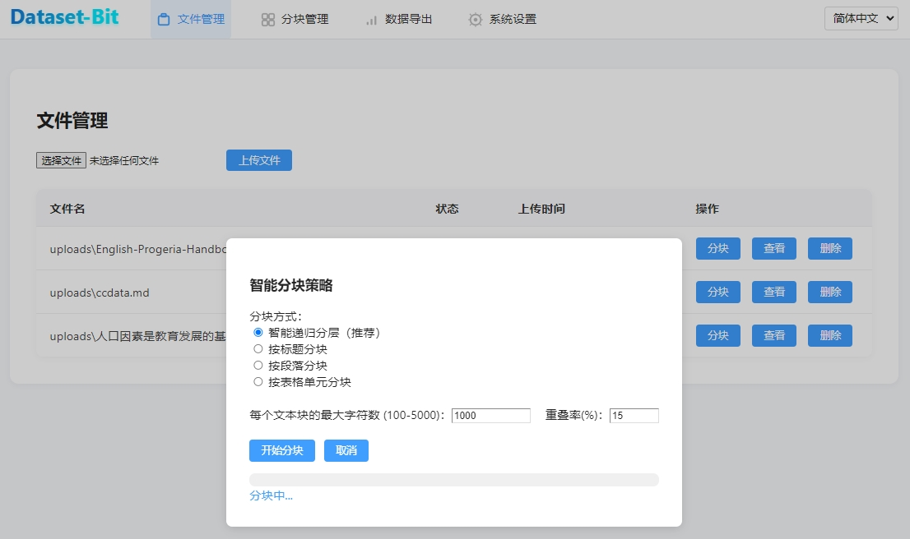

# Dataset-Bit 🚀

[](https://www.python.org/downloads/)
[](https://fastapi.tiangolo.com/)
[](https://vuejs.org/)
[](LICENSE)
[](https://gitee.com/yorkoliu/dataset-bit)

[English](README_EN.md) | [中文](README.md)

---

## 📖 Project Overview

Dataset-Bit is an open-source tool for building high-quality fine-tuning datasets for LLMs. It supports smart chunking of various document formats, batch AI QA generation, flexible scoring and export, and efficient batch operations. Ideal for developers, annotation teams, and AI researchers.

### ✨ Key Features
- **Smart Document Chunking**: Upload TXT, MD, DOCX, PDF, and more. Supports multiple chunking strategies (paragraph, heading, recursive) and custom parameters for block size and overlap.
- **AI QA Generation**: Batch-select chunks and generate diverse, high-quality QA pairs via LLMs. Progress bar and model parameter customization supported.
- **QA Scoring System**: Manual 5-star scoring with visual highlight; batch auto-scoring via external API; results saved in real time for easy filtering and quality control.
- **Flexible Data Export**: Export in Alpaca, ShareGPT, and other formats; supports JSON/CSV/Markdown; filter exported QA pairs by star rating to ensure data quality.
- **Batch Operations**: Efficient batch scoring and deletion for both chunks and QA pairs, boosting productivity for large-scale data processing.

---

## 🚀 Installation & Startup
1. Clone the repo and enter the directory
   ```bash
   git clone https://gitee.com/yorkoliu/dataset-bit.git
   cd dataset-bit
   ```
2. Install dependencies
   ```bash
   python -m venv venv
   # Windows
   venv\Scripts\activate
   # Linux/Mac
   source venv/bin/activate
   pip install -r requirements.txt
   ```
3. Initialize the database
   ```bash
   sqlite3 dataset_bit.db < init_db.sql
   ```
4. Configure .env and set your API keys
5. Start the backend
   ```bash
   python main.py
   ```
6. Visit http://localhost:8000

---

## 📁 Project Structure
```
dataset-bit/
├── app/                # Backend main program
│   ├── main.py         # FastAPI entry
│   ├── ...
├── frontend/           # Frontend pages & static resources
│   └── templates/
├── uploads/            # Upload directory
├── exports/            # Export directory
├── init_db.sql         # Database schema
├── requirements.txt    # Dependencies
└── README.md
```

---

## 👨‍💻 Development Guide
- Backend: PEP8, type hints, logging, async I/O, unit tests
- Frontend: Vue3 Composition API, componentization, TypeScript, responsive design, ESLint
- Contribution: Fork, branch, PR, with tests

---

## 📝 Changelog
### v1.0.1
- Initial release: document chunking, AI QA generation, scoring, export, batch operations, and more

---

## 📄 License
MIT License. See LICENSE for details.

---

## 📞 Contact
- Author: York Liu
- Email: liutiansi@gmail.com
- Gitee: [yorkoliu](https://gitee.com/yorkoliu)

---

## 🙏 Acknowledgement
Thanks to all contributors and users of this project!

---

## 🖼️ UI Preview
- Dataset management, chunk management, QA scoring, export, and other pages all support batch operations and progress bars. Clean and modern UI.

### Smart Chunking
- 
### Dataset Management
- 
### Dataset Export
- 
### Alpaca Format Example
```
[
  {
    "instruction": "What is the main purpose of the disclaimer mentioned in the text?",
    "input": "",
    "output": "The main purpose of the disclaimer is to inform readers that the document may contain references to products or services not available in all regions."
  },
  {
    "instruction": "Can you provide an example of a situation where this disclaimer might be important?",
    "input": "",
    "output": "This disclaimer might be important if a reader from a specific region tries to access or purchase a product or service mentioned in the document but finds it unavailable in their area."
  },
  {
    "instruction": "Is the document guaranteed to offer global availability for all its referenced products and services?",
    "input": "",
    "output": "No, the document explicitly states that not all products or services mentioned may be available globally."
  },
  {
    "instruction": "How might this disclaimer affect a business's marketing strategy?",
    "input": "",
    "output": "The disclaimer could lead a business to adjust its marketing strategy by clearly indicating regional availability for certain products or services to manage customer expectations."
  },
  {
    "instruction": "What should a user do if they encounter a product or service in this document that is unavailable in their region?",
    "input": "",
    "output": "If a user encounters a product or service unavailable in their region, they should consider exploring alternative options or contacting the provider for more information on potential future availability."
  },
  {
    "instruction": "What is the book dedicated to?",
    "input": "",
    "output": "The book is dedicated to all children with Progeria."
  }
]
```

---

For Chinese documentation, see [README.md]

## Quick Start

### 1. Pull the image

```bash
docker pull yorko/dataset-bit:latest
```

### 2. Run the container

```bash
docker run -d -p 8000:8000 yorko/dataset-bit:latest
```

Then open [http://localhost:8000](http://localhost:8000) in your browser.

## Advanced Usage (Docker Compose)

Create a `docker-compose.yml` file:

```yaml
version: '3.8'

services:
  web:
    image: yorko/dataset-bit:latest
    ports:
      - "8000:8000"
    environment:
      - APP_HOST=0.0.0.0
      - APP_PORT=8000
    restart: unless-stopped
```

Start the service:

```bash
docker-compose up -d
```

## Notes

- The image includes an initialized `dataset_bit.db` database and all files in the `uploads` directory at build time.
- For persistent data, it is recommended to mount the `/app/uploads` and `/app/exports` directories.
- For development, refer to the `docker-compose.dev.yml` example in the repository.

## License

MIT 